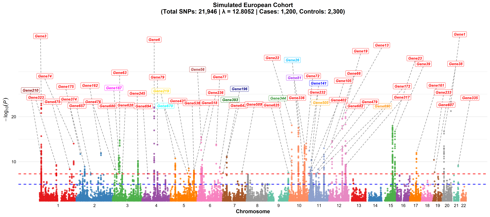
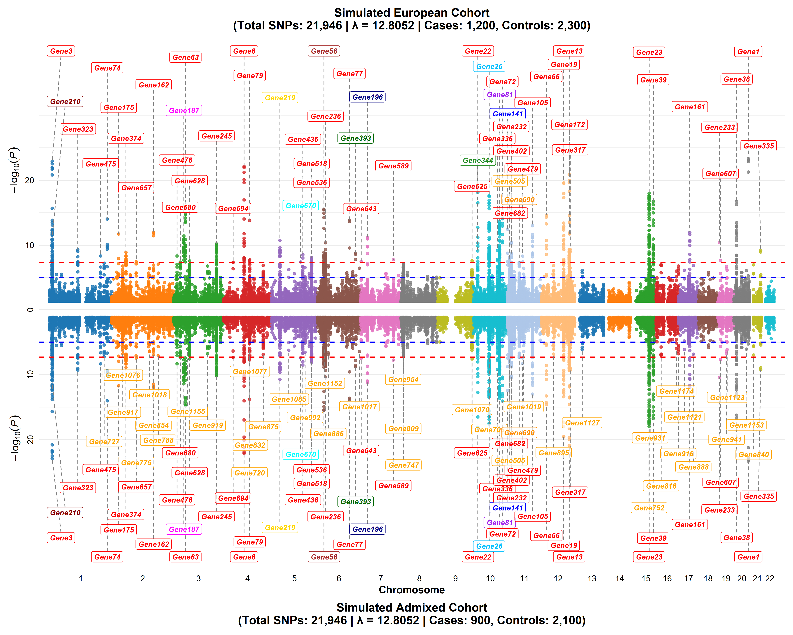

# manhattantwin

**manhattantwin** is an R package for generating publication-quality Manhattan plots (single) and Miami plots (mirrored/inverted Manhattan pair plots) for GWAS data. It provides advanced features for SNP clustering, gene labeling, and customizable plot outputs.

## Features


## Features

- **SNP clustering:** Automatically clusters SNPs by genomic distance and p-value, selecting the most significant SNP (lowest p-value) in each cluster and linking it to the associated gene. This helps highlight the best candidate SNP for each locus.
- **Region expansion for highly significant SNPs:** The package can expand and visually emphasize regions associated with extremely significant SNPs (e.g., those with p-values less than 5e-10), making it easier to interpret and present key findings. This is controlled by the `y_axis_squish_threshold` parameter (e.g., `y_axis_squish_threshold = 10`).
- Generate single Manhattan plots with gene/group labeling
- Create inverted Manhattan pair plots for comparative studies
- Publication-ready PNG and PDF outputs
- **Customizable gene label colors:** Use different colors for each gene threshold, making it easy to visually distinguish significance levels on your plots.

## Installation

You can install the latest version of **manhattantwin** directly from GitHub using the `devtools` package:

```r
# Install devtools if you don't have it
install.packages("devtools")

# Install manhattantwin from GitHub
devtools::install_github("AlsammanAlsamman/manhattantwin")
```


## Example Data

Here is a sample of the example GWAS dataset included in the package:

```r
gwasdataseta <- manhattantwin::cluster_snps(
  gwasdataseta,
  chr_col = "chr",
  pos_col = "pos",
  pvalue_col = "pvalue",
  rsid_col = "rsid",
  pvalue_threshold = 5e-8,
  distance_threshold = 250000
)

gwasdatasetb <- manhattantwin::cluster_snps(
  gwasdataseta,
  chr_col = "chr",
  pos_col = "pos",
  pvalue_col = "pvalue",
  rsid_col = "rsid",
  pvalue_threshold = 5e-5,
  distance_threshold = 250000
)

# View the first few rows
head(gwasdataseta)
#>   chr      pos   pvalue  gene rsid
#> 1  20 57179210 4.86e-24 Gene1  rs1
#> 2  20 57174000 8.17e-24 Gene2  rs2
#> 3   1 11783430 1.20e-23 Gene3  rs3
#> 4  20 57184512 1.33e-23 Gene4  rs4
#> 5   1 11788391 3.03e-23 Gene5  rs5
#> 6   4 81383747 7.36e-23 Gene6  rs6
```

data("gwasdataseta")
gwasdataseta <- manhattantwin::cluster_snps(

### 1. Single Manhattan Plot

```r
library(manhattantwin)
data("gwasdataseta")

# Define metadata for two example cohorts
cohortA <- list(
  name = "Simulated European Cohort",
  n_cases = 1200,
  n_controls = 2300
)
cohortB <- list(
  name = "Simulated Admixed Cohort",
  n_cases = 900,
  n_controls = 2100
)

# Cluster SNPs for each cohort with different p-value thresholds
gwasA <- manhattantwin::cluster_snps(
  gwasdataseta,
  chr_col = "chr",
  pos_col = "pos",
  pvalue_col = "pvalue",
  rsid_col = "rsid",
  pvalue_threshold = 5e-8,
  distance_threshold = 250000
)
gwasB <- manhattantwin::cluster_snps(
  gwasdataseta,
  chr_col = "chr",
  pos_col = "pos",
  pvalue_col = "pvalue",
  rsid_col = "rsid",
  pvalue_threshold = 1e-6,
  distance_threshold = 250000
)

highlight_genes <- c(
  "Gene1" = "red",
  "Gene141" = "blue",
  "Gene393" = "darkgreen",
  "Gene81" = "purple",
  "Gene505" = "orange",
  "Gene56" = "brown",
  "Gene670" = "cyan",
  "Gene187" = "magenta",
  "Gene219" = "gold",
  "Gene210" = "darkred",
  "Gene196" = "navy",
  "Gene344" = "forestgreen",
  "Gene690" = "darkorange",
  "Gene26" = "deepskyblue"
)

# Plot single Manhattan for cohort A
manhattantwin::plot_single_manhattan(
  gwasA,
  plot_title_prefix = cohortA$name,
  p_col = "pvalue",
  n_cases = cohortA$n_cases,
  n_controls = cohortA$n_controls,
  file_name_prefix = "sim_eur",
  group_col = "cluster",
  gene_col = "gene",
  output_folder = "single_plots",
  y_axis_squish_threshold = 30,
  label_threshold_colors = c("red" = 5e-8, "orange" = 1e-6, "darkblue" = 1e-5),
  custom_gene_colors = highlight_genes
)
```

#### Example Output




---

gwasdatasetb <- manhattantwin::cluster_snps(

### 2. Miami Plot (Mirrored Manhattan Pair Plot)

```r
# Plot mirrored Manhattan for comparison
create_mirrored_manhattan_plot(
  gwasA,
  gwasB,
  chr_col = "chr",
  bp_col = "pos",
  p_col = "pvalue",
  n_cases1 = cohortA$n_cases,
  n_controls1 = cohortA$n_controls,
  n_cases2 = cohortB$n_cases,
  n_controls2 = cohortB$n_controls,
  file_name_prefix = "sim_eur_vs_admixed",
  group_col = "cluster",
  gene_col = "gene",
  label_threshold_colors = c("red" = 5e-8, "orange" = 1e-6, "darkblue" = 1e-5),
  output_folder = "Inverted_Manhattan_Plots",
  y_axis_squish_threshold = 30,
  plot_title1 = cohortA$name,
  plot_title2 = cohortB$name,
  custom_gene_colors = highlight_genes,
  label_alpha = 0.7,
  label_orientation = "vertical",
  output_width = 15
)
```



*In the plot above, different colors are used for gene labels based on their significance thresholds (e.g., red for p < 5e-8, orange for p < 1e-6, dark blue for p < 1e-5).*

## Data

The package includes an example GWAS dataset `gwasdataseta` for demonstration purposes.

## License

MIT License. See `LICENSE` file for details.

## Authors

See package DESCRIPTION for author information.
