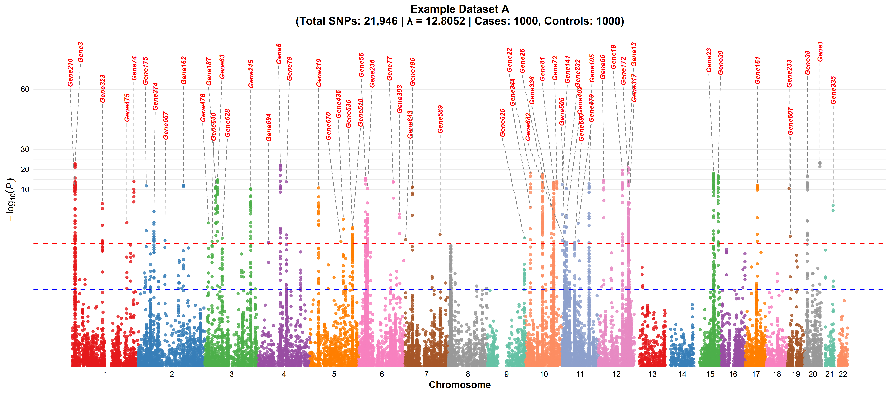
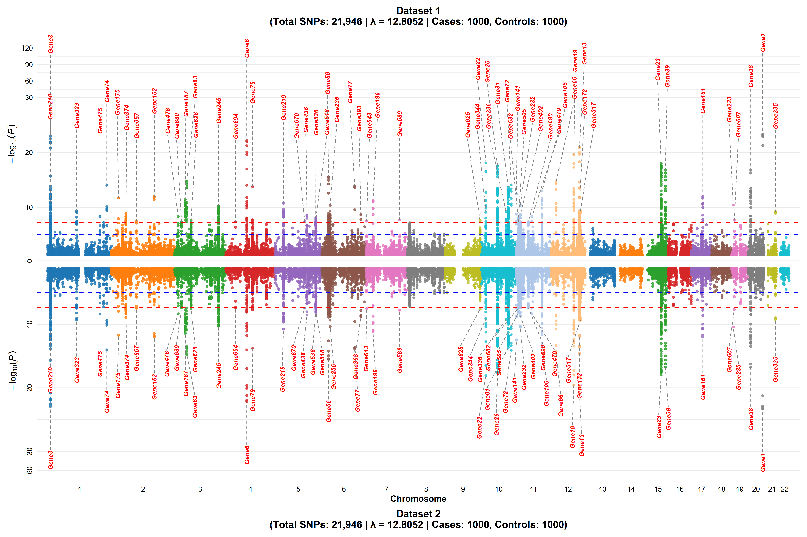

# manhattantwin

**manhattantwin** is an R package for generating publication-quality Manhattan plots and inverted Manhattan pair plots for GWAS data. It provides advanced features for SNP clustering, gene labeling, and customizable plot outputs.

## Features
- Cluster SNPs by genomic distance and p-value
- Generate single Manhattan plots with gene/group labeling
- Create inverted Manhattan pair plots for comparative studies
- Publication-ready PNG and PDF outputs


## Installation

You can install the latest version of **manhattantwin** directly from GitHub using the `devtools` package:

```r
# Install devtools if you don't have it
install.packages("devtools")

# Install manhattantwin from GitHub
devtools::install_github("AlsammanAlsamman/manhattantwin")
```


## Example Usage

### 1. Single Manhattan Plot

```r
library(manhattantwin)
data("gwasdataseta")

# Cluster SNPs
gwasdataseta <- manhattantwin::cluster_snps(
  gwasdataseta,
  chr_col = "chr",
  pos_col = "pos",
  pvalue_col = "pvalue",
  rsid_col = "rsid",
  pvalue_threshold = 5e-8,
  distance_threshold = 250000
)

# Generate single Manhattan plot
manhattantwin::plot_single_manhattan(
  gwasdataseta,
  plot_title_prefix = "Example Dataset A",
  p_col = "pvalue",
  n_cases = 1000,
  n_controls = 1000,
  file_name_prefix = "example_a",
  group_col = "cluster",
  gene_col = "gene",
  output_folder = "single_plots"
)
```

#### Example Output



---

### 2. Inverted Manhattan Pair Plot

```r
# Cluster a second dataset (for demonstration, using the same data)
gwasdatasetb <- manhattantwin::cluster_snps(
  gwasdataseta,
  chr_col = "chr",
  pos_col = "pos",
  pvalue_col = "pvalue",
  rsid_col = "rsid",
  pvalue_threshold = 5e-8,
  distance_threshold = 250000
)

# Generate inverted Manhattan pair plot
manhattantwin::manhattan_pair_plot(
  gwasdataseta,
  gwasdatasetb,
  chr_col = "chr",
  bp_col = "pos",
  p_col = "pvalue",
  n_cases1 = 1000,
  n_controls1 = 1000,
  n_cases2 = 1000,
  n_controls2 = 1000,
  file_name_prefix = "example_a_vs_b",
  group_col = "cluster",
  gene_col = "gene",
  output_folder = "pair_plots"
)
```

## Data

The package includes an example GWAS dataset `gwasdataseta` for demonstration purposes.

## License

MIT License. See `LICENSE` file for details.

## Authors

See package DESCRIPTION for author information.
